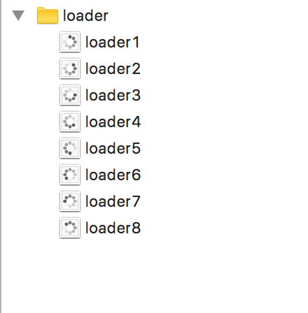

# The missing apple watch loader


# 🐧 How to use?

Put a centralized ```WKInterfaceImage``` in your storyboard, create the ```@IBOutlet``` copy the images to the correct bundle and implement the ***start*** and ***stop*** loader.

### Example

```swift
    @IBOutlet var loader: WKInterfaceImage!
    
    func showLoader() {
        loader.setImageNamed("loader")
        loader.startAnimatingWithImages(in: NSRange(location: 1,
                                                    length: 8), duration: 0.8, repeatCount: -1)
    }
    
    func stopLoader() {
        self.loader.stopAnimating()
    }
    
```

The image name ```loader``` :


